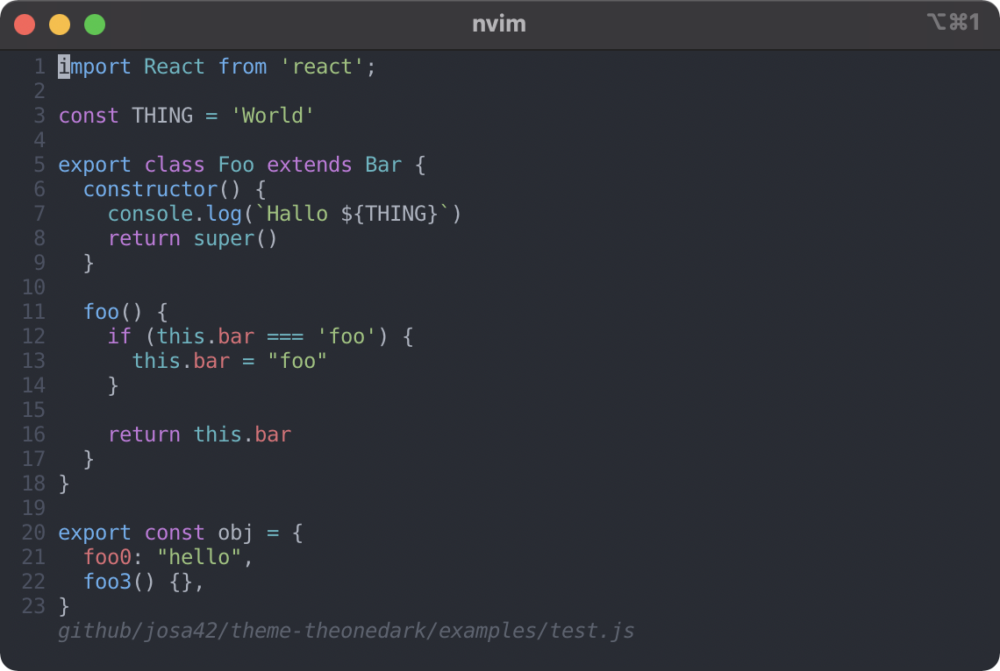

# The One Dark

> One Theme to rule them all, One Theme to find them,  
> One Theme to bring them all, and in the darkness bind them



[All screenshots](docs/screenshots.md)

## Contained Themes

- neovim / vim
- lightline (vim)

## Generate

```sh
go run build/main.go
```

```
foo abr
```

## Credit

The themes is based on or inspired by these projects:

- [`joshdick/onedark.vim`](https://github.com/joshdick/onedark.vim)
- [`NovaDev94/lightline-onedark`](https://github.com/NovaDev94/lightline-onedark)
- [`atom/atom`: `one-dark-syntax`](https://github.com/atom/atom/tree/master/packages/one-dark-syntax)

## License

[MIT © Josa Gesell](LICENSE)
